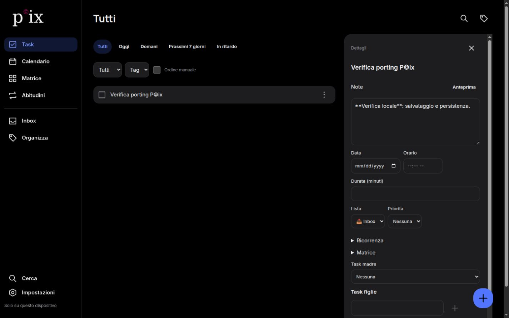

<div align="center">

# P©ix
**Plan clearly. Capture quickly. Stay in control.**

An offline-first productivity workspace for **Android, Web and Desktop** — combining tasks, calendars, the Eisenhower Matrix, habits and flexible organization.

[](app/)
[](gradle/libs.versions.toml)
[](app/)
[](web/)
[](web/src-tauri/)
[](docs/IMPLEMENTATION_STATUS.md)

[Features](#-features) · [Platforms](#-platforms) · [Getting started](#-getting-started) · [Architecture](#-architecture) · [Roadmap](#-roadmap)

</div>

---

## A more intentional way to get things done

P©ix helps turn thoughts into actionable tasks without demanding a complicated setup. Start with a quick entry, then add a list, tag, due date, priority, recurrence or reminder only when you need it.

**Local-first is a design choice, not a fallback.** Android uses Room; the Web/Desktop client uses IndexedDB. The app is designed to keep core interactions responsive even without a network connection.

> **Development status:** P©ix is under active development. Cloud, OAuth and external calendar support exist in the codebase, but production-grade, real-account end-to-end verification is not yet complete. See [Current implementation status](docs/IMPLEMENTATION_STATUS.md) and [Web/Desktop implementation notes](WEB_DESKTOP_IMPLEMENTATION.md).

## ✨ Features

| Area | Highlights |
| --- | --- |
| **Quick capture** | Quick Add, notes, priorities, dates, duration, tags and lists |
| **Task management** | Complete/reopen, duplicate, postpone, subtasks and parent/child hierarchy |
| **Organization** | Protected Inbox, custom lists, colors, icons, tags, search and manual ordering |
| **Calendar** | Month/week views, timed and all-day tasks, multi-day intervals |
| **Recurrence** | Daily, weekdays, selected weekdays, monthly, yearly and custom rules |
| **Eisenhower Matrix** | Four-quadrant planning with automatic classification, custom cards and filters |
| **Reminders** | Android notifications with Complete/Postpone actions; local scheduling |
| **Habits** | Check/quantity habits, groups, history, statistics and CSV workflows |
| **Attachments** | Local images and task notes; local backup of attachments |
| **Backup** | Versioned ZIP export/import with validation |
| **Personalization** | Light/dark/system themes, fonts, text sizing, colors and layout preferences |
| **Widgets (Android)** | Home-screen task, calendar and Matrix experiences powered by Glance |

Features and interface details vary by platform. In particular, the Web/Desktop port does **not** yet have complete Android feature parity.

## 🖥 Platforms

### Android — native Kotlin and Jetpack Compose

The original and most mature P©ix client. Its architecture combines Room persistence, a repository layer, Compose views, ViewModels, WorkManager and AlarmManager.

Android also includes launcher widgets and the more complete native reminder behavior.

- **Package:** `com.example.pix`
- **Minimum Android:** API 26 (Android 8.0)
- **Compile / target SDK:** 37
- **Android app version:** `1.0` (`versionCode` 1)

### Web — React, TypeScript and Vite

The Web client shares P©ix's core concepts, data model and visual language, but is implemented separately with React, TypeScript and IndexedDB/Dexie.

It includes tasks, calendar, Matrix, habits, lists, tags, offline data, account flows and cloud sync support. Google Calendar is kept separate from P©ix tasks and is read-only.

### Desktop — Tauri 2 (Windows/Linux)

The Desktop client packages the **same React frontend** using Tauri. There is no separate Windows or Linux UI codebase.

The repository documents a successful Linux `.deb` build and installation, but native UI workflows have not received complete functional validation. A Windows build has not been confirmed.



*Development screenshot of the Web/Desktop interface; some details may differ from the latest Android UI.*

## 🧩 Architecture

```text
                        P©ix
                          │
             ┌────────────┴─────────────┐
             │                          │
         Android                    Web / Desktop
     Kotlin + Compose              React + Vite
             │                          │
      ViewModels / UI             Web app / Tauri
             │                          │
        Repositories                Repositories
             │                          │
       Room / SQLite              Dexie / IndexedDB
             │                          │
             └─────────┬────────────────┘
                       │
                 Sync protocol
                       │
                Supabase backend
                Auth + SQL / RLS

        Google Calendar (read-only integration)
        is kept separate from P©ix task data.
```

Local writes are handled in a durable local store. For account-based synchronization, an outbox and versioned server protocol are designed to reconcile changes while keeping local interaction independent of network availability.

**Important boundaries:** Google Calendar integration is read-only; image bytes are currently local/backup-only and are not synchronized through cloud storage. Cross-device sync and real OAuth still require configured services and end-to-end verification.

### Technology at a glance

| Component | Technology |
| --- | --- |
| Android UI | Kotlin, Jetpack Compose, Material 3 |
| Android persistence | Room 2.8.4 / SQLite |
| Android background work | WorkManager 2.11.1, AlarmManager |
| Android widgets | AndroidX Glance 1.2.0 |
| Android build | Android Gradle Plugin 9.3.2, Kotlin 2.2.10, Gradle 9.5.0 |
| Web UI | React 19, TypeScript, Vite |
| Web offline database | Dexie / IndexedDB |
| Web tests | Vitest |
| Desktop | Tauri 2, Rust |
| Cloud infrastructure | Supabase Auth, PostgreSQL, RLS and sync RPCs |
| Calendar integration | Google Calendar read-only |

## 🚀 Getting started

### Clone

```bash
git clone https://github.com/ross-noda/pcix.git
cd pcix
```

### Android

Open the repository root in Android Studio and install the Android SDK specified by the project. Use a JDK compatible with the configured Android Gradle Plugin (prefer the IDE's bundled runtime where available).

Build locally:

```bash
./gradlew assembleDebug
```

On Windows, replace `./gradlew` with `gradlew.bat`.

Generated debug APK:

```text
app/build/outputs/apk/debug/app-debug.apk
```

Android configuration for Supabase and Google is read from the **untracked** `local.properties`:

```properties
supabase.url=https://YOUR_PROJECT.supabase.co
supabase.anonKey=YOUR_PUBLIC_ANON_OR_PUBLISHABLE_KEY
google.webClientId=YOUR_WEB_OAUTH_CLIENT_ID.apps.googleusercontent.com
```

Keep server secrets and service-role keys out of this file and out of client apps. See [CLOUD_SETUP.md](CLOUD_SETUP.md) and [AUTH_SETUP.md](AUTH_SETUP.md) for the full setup.

For *isolated local Android UI regression tests only*, a debug build can explicitly disable cloud configuration:

```bash
./gradlew connectedDebugAndroidTest -Ppix.offlineTestBuild=true
```

This option is **not** a substitute for a configured cloud build and should not be used to validate account sync.

### Web

Requires **Node.js 22.12+ (or Node 24)** and **pnpm**.

```bash
cd web
cp .env.example .env
pnpm install --frozen-lockfile
pnpm dev
```

The development server is configured for `http://127.0.0.1:5173`. The Web app has an offline guest mode; online features need credentials/configuration.

Configure the **public** variables in `web/.env`:

```dotenv
VITE_SUPABASE_URL=
VITE_SUPABASE_ANON_KEY=
VITE_AUTH_REDIRECT_URL=http://127.0.0.1:5173/
VITE_GOOGLE_CALENDAR_CLIENT_ID=
```

Make sure your Supabase and Google authorized URLs match the origin actually used; `localhost` and `127.0.0.1` are different origins.

Common development commands:

```bash
pnpm test
pnpm typecheck
pnpm format:check
pnpm build
pnpm preview --port 5173
```

### Desktop

The Tauri shell lives in `web/src-tauri`. Install Rust/Cargo and your operating system's required Tauri dependencies.

From `web/`:

```bash
pnpm desktop:dev
pnpm desktop:build
```

For detailed Linux and Windows requirements, OAuth deep links, bundle locations and limitations, see [WEB_DESKTOP_IMPLEMENTATION.md](WEB_DESKTOP_IMPLEMENTATION.md).

## ✅ Testing & verification

The repository includes Android unit and instrumentation tests, SQL protocol/RLS checks and Web tests.

Run Android checks:

```bash
./gradlew assembleDebug testDebugUnitTest lintDebug --max-workers=2
```

Android instrumentation tests require a running emulator/device and can **modify test data**. Use a dedicated test installation.

Web validation:

```bash
cd web
pnpm test
pnpm typecheck
pnpm format:check
pnpm build
```

Reported in the Web/Desktop implementation notes on **9 October 2026**:

- Web tests: **34/34 passing**
- Web build and format checks: **passing**
- Linux Tauri `.deb` build and installation: **successful**
- Native Windows build: **not verified**
- Real login, Google Calendar and Android ↔ cloud ↔ Web round trip: **not yet exercised end-to-end**

These are documented results, **not test executions performed by this README update**.

A manually triggered Windows/Linux GitHub Actions workflow exists in [`.github/workflows/web-desktop.yml`](.github/workflows/web-desktop.yml). It is **not** a claim of continuous green CI.

## 🗂 Repository structure

```text
pcix/
├── app/                          # Native Android application
│   └── src/                      # Source, tests and resources
├── web/                          # React/TypeScript application
│   ├── src/                      # Web app and shared desktop frontend
│   └── src-tauri/                # Native desktop wrapper
├── supabase/                     # SQL migrations, tests and functions
├── docs/                         # Specifications, audits and verification
├── .github/workflows/            # Manually triggered desktop build workflow
├── AUTH_SETUP.md                 # OAuth and account configuration
├── CLOUD_SETUP.md                # Cloud deployment/configuration
├── WEB_DESKTOP_IMPLEMENTATION.md # Port status and platform caveats
├── gradle/                       # Gradle wrapper and dependency catalog
└── README.md
```

## 🗺 Roadmap

| Track | Current direction |
| --- | --- |
| **Android foundation** | Rich native task/calendar/Matrix/widget functionality implemented; continue device and accessibility hardening |
| **Authentication** | Code and test infrastructure present; validate real provider callbacks and account lifecycle |
| **Cloud sync** | Versioned protocol/outbox implemented; deploy and test on real Supabase with multiple devices |
| **Google Calendar** | Read-only integration implemented; verify multi-account OAuth and live event behavior |
| **Web** | Usable local port available; improve Android feature parity, UX and end-to-end cloud testing |
| **Desktop** | Linux build demonstrated; validate native workflows and build/test Windows |
| **Offline reliability** | Verify initial offline startup, service worker upgrades and device-specific behaviors |
| **Cross-platform reminders** | Improve parity with Android's background notification scheduling |
| **Release readiness** | Installer signing, real service testing, accessibility and production deployment remain future work |

## 📖 Project documentation

- [Android implementation status](docs/IMPLEMENTATION_STATUS.md)
- [Current verification and limitations](docs/VERIFICATION.md)
- [Cloud and Google audit](docs/FINAL_GOOGLE_CLOUD_AUDIT.md)
- [Authentication setup](AUTH_SETUP.md)
- [Cloud setup and SQL deployment](CLOUD_SETUP.md)
- [Web/Desktop implementation and test results](WEB_DESKTOP_IMPLEMENTATION.md)
- [Web/Desktop Android parity audit](docs/WEB_DESKTOP_AUDIT.md)
- [Architecture](docs/ARCHITECTURE.md)
- [Sync protocol](docs/SYNC_PROTOCOL.md)

## 🤝 Contributions & feedback

Bug reports and proposals are welcome through [GitHub Issues](https://github.com/ross-noda/pcix/issues). Please include the affected platform, steps to reproduce, expected behavior and relevant logs (with credentials and personal data removed).

**License:** No repository-level software license was present when this README was prepared. Do not assume unrestricted reuse or redistribution; bundled font and asset licenses are separate and may be documented in their respective folders.

---

<div align="center">

**P©ix — less friction, more focus.**

[Repository](https://github.com/ross-noda/pcix) · [Report an issue](https://github.com/ross-noda/pcix/issues)

</div>
